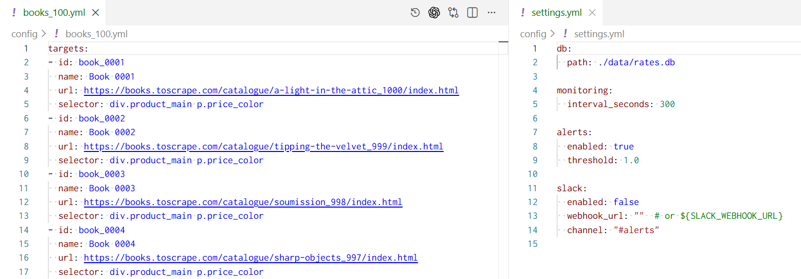
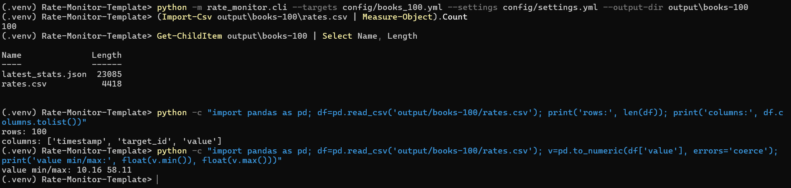
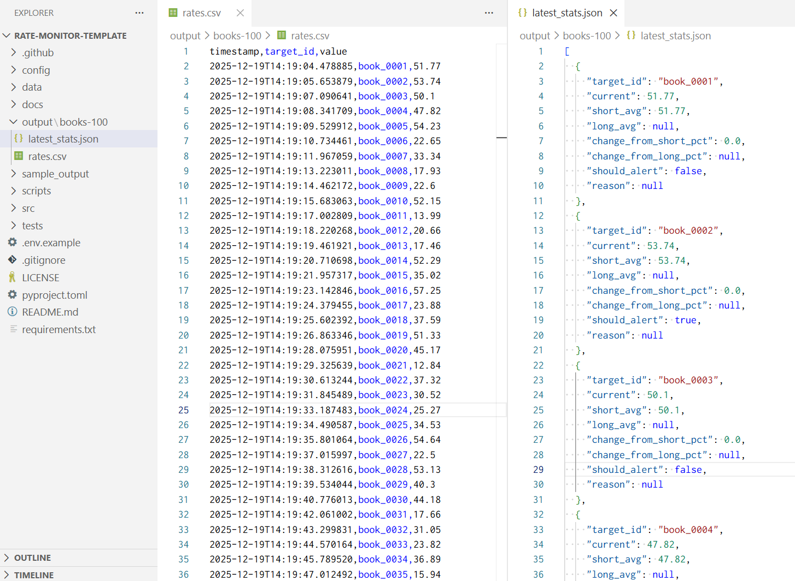

# Rate Monitor Template


A configuration-driven Python template that monitors numeric rates/prices from web pages, stores time-series observations in SQLite, analyzes changes using moving averages, and exports run artifacts—designed for scheduled, real-world operation.

---

## Demo Screenshots

* Demo Screenshots

| Config (targets + settings) | CLI run (collect 100 observations) | Artifacts (CSV + computed stats / alert decision) |
| --- | --- | --- |
|  |  |  |

> Demo shown uses public test pages (Books to Scrape). Replace targets with permitted sources for real monitoring.

---

## What this repository provides
This project is a practical, reusable baseline for “monitoring a small set of changing numeric values on the web” with engineering discipline:

- **Config-driven targets (YAML):** add or modify monitored sources without code changes
- **Layered pipeline:** fetch → parse → persist → analyze → notify → export
- **Time-series persistence:** SQLite storage for history and auditability
- **Operational readiness:** built as a single-run job for cron / Windows Task Scheduler
- **Test coverage:** unit tests for each module with mocked external boundaries

---

## Core features (current implementation)
For each configured target, the CLI run:

1. Fetches the target URL (HTTP GET with retries on transient failures)
2. Extracts a numeric value from HTML using a CSS selector
3. Writes the observation into SQLite (skipped with `--dry-run`)
4. Loads recent history for the target from SQLite (time-window filtered)
5. Computes moving averages and percentage deltas (observation-windowed)
6. Emits an alert when change exceeds a configured threshold
7. Exports run artifacts:
   - `rates.csv` (values collected in the current run)
   - `latest_stats.json` (computed stats + alert decisions)

This tool is intentionally a **single-run batch executable**. Scheduling is handled externally.

---

## Typical use cases
- FX / crypto / benchmark rate monitoring
- Price monitoring for permitted sources (e.g., internal pages or sources that allow automated access)
- Lightweight change-detection pipelines that export CSV/JSON for downstream automation
- Monitoring prototypes that can be extended into richer alerting and observability systems

---

## Architecture at a glance
**Pipeline:** config → fetch → parse → persist → analyze → notify → export

Key modules:
- `config.py` — YAML config loading into typed structures
- `fetcher.py` — HTTP client with retry logic and explicit error types
- `parser.py` — CSS selector extraction + numeric normalization
- `db.py` — SQLite schema initialization + insert + history queries
- `analyzer.py` — moving averages + threshold-based alert decision
- `notifier.py` — stdout notifier; Slack webhook notifier implementation exists
- `exporter.py` — CSV/JSON run artifact writers
- `cli.py` — orchestration entrypoint (single-run)

See: [`docs/architecture.md`](docs/architecture.md)

---

## Directory structure
```

.
├─ src/
│  └─ rate_monitor/
│     ├─ cli.py
│     ├─ config.py
│     ├─ fetcher.py
│     ├─ parser.py
│     ├─ db.py
│     ├─ analyzer.py
│     ├─ notifier.py
│     ├─ exporter.py
│     └─ scheduler_stub.py
├─ config/
│  ├─ settings.example.yml
│  └─ targets.example.yml
├─ data/
│  └─ rates.db
├─ sample_output/
│  ├─ rates.csv
│  ├─ latest_stats.json
│  └─ rates.sample.csv
├─ tests/
└─ docs/

````

---

## Tech stack
- **Python** 3.12+ recommended
- **requests** — HTTP fetching (with retry on transient errors)
- **BeautifulSoup4** — HTML parsing using CSS selectors
- **sqlite3** — local persistence (time-series table + index)
- **pytest** — unit tests
- **GitHub Actions** — CI (pytest)

---

## Setup

### Prerequisites
- Python 3.12+ (recommended)
- Git

### 1) Clone and create a virtual environment
```bash
git clone https://github.com/ryuhei-py/Rate-Monitor-Template.git
cd Rate-Monitor-Template

python -m venv .venv
````

Activate the environment:

**Windows (PowerShell)**

```powershell
.\.venv\Scripts\Activate.ps1
```

**macOS/Linux**

```bash
source .venv/bin/activate
```

### 2) Install dependencies

```bash
pip install -r requirements.txt
```

### 3) Ensure the `src/` package is importable

This repository uses a `src/` layout. To run the CLI reliably in a clean environment, use one of the following approaches.

#### Option A (recommended for simplicity): set `PYTHONPATH=src` when running commands

**Windows (PowerShell)**

```powershell
$env:PYTHONPATH="src"
python -m rate_monitor.cli --help
```

**macOS/Linux**

```bash
PYTHONPATH=src python -m rate_monitor.cli --help
```

#### Option B: install the project in editable mode

If your environment is configured to support editable installs for this project, you can do:

```bash
pip install -e .
python -m rate_monitor.cli --help
```

> If you hit `ModuleNotFoundError: rate_monitor`, use Option A above.

### 4) Create runnable configuration files

The example configs are templates. Copy them to real config files:

```bash
cp config/targets.example.yml config/targets.yml
cp config/settings.example.yml config/settings.yml
```

### 5) Configure at least one target

Edit `config/targets.yml` and add real targets. Minimal example:

```yaml
targets:
  - id: usd_jpy
    name: USD/JPY
    url: "https://example.com/rates"
    selector: ".rate-value"
```

### 6) Run a first execution (dry-run recommended)

Dry-run verifies fetch/parse/analyze/export without writing to SQLite:

**Windows (PowerShell)**

```powershell
$env:PYTHONPATH="src"
python -m rate_monitor.cli --dry-run --targets config/targets.yml --settings config/settings.yml --output-dir sample_output
```

**macOS/Linux**

```bash
PYTHONPATH=src python -m rate_monitor.cli --dry-run --targets config/targets.yml --settings config/settings.yml --output-dir sample_output
```

Artifacts produced:

* `sample_output/rates.csv`
* `sample_output/latest_stats.json`

### 7) Run a real execution (writes to SQLite)

**Windows (PowerShell)**

```powershell
$env:PYTHONPATH="src"
python -m rate_monitor.cli --targets config/targets.yml --settings config/settings.yml --output-dir sample_output
```

**macOS/Linux**

```bash
PYTHONPATH=src python -m rate_monitor.cli --targets config/targets.yml --settings config/settings.yml --output-dir sample_output
```

---

## Configuration

### Targets (`config/targets.yml`)

Each target requires:

* `id` — stable identifier (used in DB + exports)
* `name` — human-readable label
* `url` — page URL to fetch
* `selector` — CSS selector for the element containing the numeric value

**Parsing expectations**

* The selected element’s text should represent a number (e.g., `1234`, `1,234.56`, `$1,234.56`).
* Numeric normalization handles common currency symbols and comma/dot separators.

### Settings (`config/settings.yml`)

Common fields:

* `db.path` — path to the SQLite DB (default `./data/rates.db`)
* `alerts.threshold` — percent threshold for alerting (e.g., `1.0` means 1%)
* `monitoring.interval_seconds` — scheduling intent (the runtime is single-run; scheduling is external)

See: [`docs/CONFIG_GUIDE.md`](docs/CONFIG_GUIDE.md)

---

## Usage

### Run with explicit paths

```bash
python -m rate_monitor.cli \
  --targets config/targets.yml \
  --settings config/settings.yml \
  --output-dir sample_output
```

### Dry-run

Dry-run still fetches/parses/analyzes/exports, but **does not write** to SQLite:

```bash
python -m rate_monitor.cli \
  --targets config/targets.yml \
  --settings config/settings.yml \
  --output-dir sample_output \
  --dry-run
```

### Output artifacts

After each run:

* `rates.csv` (in `--output-dir`)

  * Header: `timestamp,target_id,value`
  * One row per processed target for the current run
* `latest_stats.json` (in `--output-dir`)

  * One JSON object per target including computed averages and alert decision

SQLite DB:

* Appends one row per target per run (unless `--dry-run`)
* Stores `(target_id, ts, value)` time-series data

---

## Alert logic (current behavior)

* **Short baseline:** moving average of the last **3 observations**
* **Long baseline:** moving average of the last **7 observations**
* An alert is emitted when the absolute percentage delta vs either baseline exceeds `alerts.threshold`

Operational notes:

* Moving averages are computed over **observations**, not “days”.
* Alerts require sufficient history (>= 3 / >= 7 points).
* The moving averages include the most recent observation (which dampens deltas vs excluding the current point).

---

## Notifications

* **Stdout notifier:** prints alert lines to the console when thresholds are exceeded.
* **Slack notifier (webhook):** implementation exists in `src/rate_monitor/notifier.py`.

Implementation note:

* If you plan to enable Slack notifications, review how the CLI selects the notifier in `src/rate_monitor/cli.py` together with the settings model in `src/rate_monitor/config.py`, and align your settings fields accordingly.

---

## Testing

Run the unit-test suite:

**Windows (PowerShell)**

```powershell
$env:PYTHONPATH="src"
pytest
```

**macOS/Linux**

```bash
PYTHONPATH=src pytest
```

The tests cover:

* YAML config loading behavior
* fetcher retry logic (mocked HTTP)
* parser numeric normalization and selector errors
* SQLite schema, insert, and history filtering
* analyzer calculations and threshold decisions
* exporter CSV/JSON output structure
* CLI dry-run orchestration (mocked boundaries)

See: [`docs/testing.md`](docs/testing.md)

---

## Operations (scheduling)

This tool is designed to be executed on a schedule using:

* cron (Linux/macOS)
* Windows Task Scheduler

See:

* [`docs/operations.md`](docs/operations.md)
* [`src/rate_monitor/scheduler_stub.py`](src/rate_monitor/scheduler_stub.py)

---

## Security, legal, and compliance

This repository is a general-purpose monitoring template:

* It does not implement access-control bypassing, crawling loops, or evasion mechanisms.
* You are responsible for ensuring your configured targets comply with the site’s Terms of Service, robots.txt expectations, and applicable laws/regulations.
* Treat output artifacts (SQLite DB, CSV/JSON exports) and webhook URLs as sensitive where appropriate.

See: [`docs/SECURITY_AND_LEGAL.md`](docs/SECURITY_AND_LEGAL.md)

---

## Extensibility

Common extension points (designed to be straightforward in this codebase):

* Per-target request options (headers, timeouts, proxies, backoff on 429)
* Richer parsing (regex numeric extraction, fallback selectors, JSON endpoints)
* Additional notifiers (Email, Teams, Discord)
* Structured logging and metrics
* Data retention policies and database backends (e.g., Postgres) behind a stable interface

---

## Related documentation

* [`docs/architecture.md`](docs/architecture.md) — components and data flow
* [`docs/CONFIG_GUIDE.md`](docs/CONFIG_GUIDE.md) — configuration reference
* [`docs/operations.md`](docs/operations.md) — scheduling and operations guidance
* [`docs/testing.md`](docs/testing.md) — test strategy and commands
* [`docs/SECURITY_AND_LEGAL.md`](docs/SECURITY_AND_LEGAL.md) — compliance guidance

---

## License

MIT License. See [`LICENSE`](LICENSE).