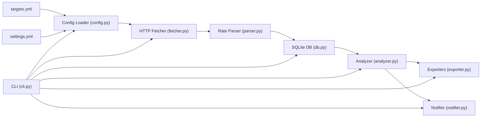
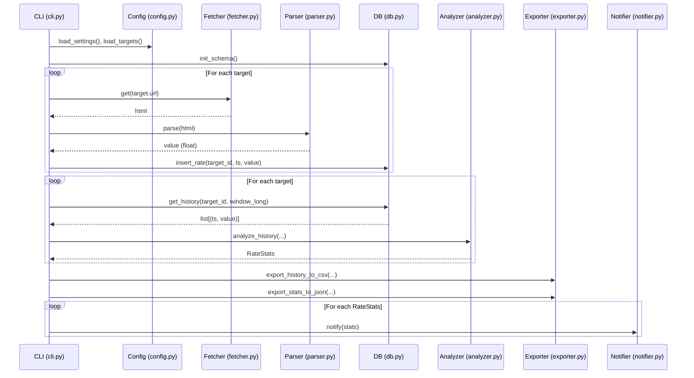

# Architecture
This section explains the architecture of the template while preserving the original narrative.

This document describes the architecture of the **Rate Monitor Template**.  
It explains how the system is structured, how data flows through it, and how each component can be extended or replaced when adapting the template to real-world projects.

---

## 1. High-level overview
This section lists the pipeline steps in order.

At a high level, the template implements the following pipeline:

1. **Config** – Load monitoring targets and settings from YAML.
2. **Fetch** – Retrieve the latest HTML for each target’s page.
3. **Parse** – Extract the numeric rate value from the HTML.
4. **Store** – Append the measurement into a SQLite time-series database.
5. **Analyze** – Compute moving averages and percentage changes for each target.
6. **Export** – Write history and latest stats to CSV / JSON.
7. **Notify** – Send alerts (stdout / Slack) when changes exceed thresholds.
8. **Schedule** – Run the CLI periodically (cron / Task Scheduler).

Conceptually:



Everything is orchestrated from a single CLI entrypoint (rate_monitor.cli.main), which can be called ad-hoc or via a scheduler.

---

## 2. Goals and non-goals
This section clarifies the intended scope.

### 2.1 Goals
Provide a clean, layered skeleton for rate/time-series monitoring projects.

Demonstrate production-like structure in a small, understandable codebase.

Make it easy to:

add new monitoring targets,

change alert thresholds,

plug in new notification channels,

reuse the architecture in Upwork-style client projects.

### 2.2 Non-goals
Not a full observability stack (no metrics backend, no dashboards).

Not a heavy framework; no external schedulers or ORMs by default.

Not tied to a specific website, API, or asset class.

Not optimized for ultra-high frequency or huge data volumes out of the box.

---

## 3. Module overview
This section maps modules to responsibilities.

All core logic lives under `src/rate_monitor/`:

```text
src/rate_monitor/
├─ __init__.py
├─ config.py
├─ fetcher.py
├─ parser.py
├─ db.py
├─ analyzer.py
├─ exporter.py
├─ notifier.py
├─ scheduler_stub.py
└─ cli.py
```

### 3.1 Config layer (config.py)
This subsection explains configuration responsibilities.

Responsibilities

Load and validate configuration from YAML:

`config/targets.yml` – list of targets to monitor.

`config/settings.yml` – DB path, window sizes, alert thresholds, Slack settings, etc.

Provide structured objects for the rest of the system to use.

Typical concepts

TargetConfig:

id: str – logical identifier (e.g. "usd_jpy").

name: str – human-readable name (e.g. "USD/JPY").

url: str – page from which to fetch the latest rate.

selector: str – CSS selector used by parser.py.

Settings:

db.path: str – file path for the SQLite database.

monitoring.window_days_short: int

monitoring.window_days_long: int

alerts.change_threshold_percent: float

slack.enabled: bool

slack.webhook_url: str

slack.channel: str

Key functions (typical)

load_targets(path: str) -> list[TargetConfig]

load_settings(path: str) -> Settings

This layer isolates all configuration concerns so that the rest of the system does not deal with raw YAML.

### 3.2 Fetching layer (fetcher.py)
This subsection explains HTTP responsibilities.

Responsibilities

Perform HTTP GET requests with basic robustness:

Timeouts

Retries on network errors and HTTP 5xx responses

Customizable headers (e.g. User-Agent)

Typical interface

Fetcher class:

__init__(self, timeout: float = 10.0, max_retries: int = 3, headers: dict | None = None)

get(self, url: str) -> str

Behavior

On success: returns response.text.

On retryable failure: retries up to max_retries.

On permanent failure: raises FetchError with relevant context (URL, status code).

By isolating HTTP concerns in a dedicated layer, fetch logic can be easily replaced or extended (e.g. proxies, authentication, rate-limiting).

### 3.3 Parsing layer (parser.py)
This subsection explains parsing responsibilities.

Responsibilities

Translate raw HTML into a numeric rate value.

Typical interface

RatePageParser:

__init__(self, selector: str)

parse(self, html: str) -> float

Behavior

Uses BeautifulSoup (or similar) to:

Find the first element matching selector.

Extract text, strip whitespace.

Normalize formats like:

"123.45"

"123,45"

"¥123.45"

Convert to float.

If the element is missing or parsing fails, raises ParseError.

This layer handles the messy details of HTML parsing and number normalization, keeping the rest of the system working with clean float values.

### 3.4 Storage layer (db.py)
This subsection explains storage responsibilities.

Responsibilities

Persist time-series data to SQLite.

Provide a small, focused API for inserting and querying rates.

Typical schema

Single table rates:

id – primary key (autoincrement)

target_id – text identifier of the monitored target

ts – timestamp (ISO text or real datetime)

value – numeric rate value

Indexes:

Index on (target_id, ts) for efficient per-target history queries.

Typical interface

RateDatabase class:

__init__(self, db_path: str)

init_schema(self) -> None

insert_rate(self, target_id: str, timestamp: datetime, value: float) -> None

get_history(self, target_id: str, days: int) -> list[tuple[datetime, float]]

SQLite is chosen because it:

Keeps the template self-contained (no external DB required).

Is enough to prove understanding of relational storage and time-series concepts.

Can be migrated to a different backend later if needed.

### 3.5 Analysis layer (analyzer.py)
This subsection explains analysis responsibilities.

Responsibilities

Turn raw historical values into meaningful statistics and alert decisions.

Typical dataclass

RateStats:

target_id: str

current: float | None

short_avg: float | None

long_avg: float | None

change_from_short_pct: float | None

change_from_long_pct: float | None

should_alert: bool

reason: str | None

Typical function

analyze_history(values, window_short, window_long, threshold_percent, target_id) -> RateStats

Behavior

If no values: returns RateStats with current=None, should_alert=False.

Computes:

Latest value (current).

Moving averages for short and long windows (if enough data is available).

Percentage changes vs. each average.

Decides should_alert if absolute percentage change exceeds the configured threshold.

Fills reason with human-readable context (e.g. "Short window change +6.0% > 5.0%").

This layer makes the system “smart” from a monitoring perspective without being complex.

### 3.6 Export layer (exporter.py)
This subsection explains export responsibilities.

Responsibilities

Export history and stats for external consumption.

Typical functions

export_history_to_csv(rows, path) -> None

Writes CSV with header timestamp,target_id,value.

export_stats_to_json(stats_list, path) -> None

Writes JSON array of RateStats objects.

Use cases

Feeding data into BI tools or spreadsheets.

Providing artifacts in Upwork deliverables.

Making quick visualizations from CSV/JSON.

### 3.7 Notification layer (notifier.py)
This subsection explains notification responsibilities.

Responsibilities

Deliver alerts to external channels in a pluggable way.

Typical interfaces

Base interface Notifier with:

notify(self, stats: RateStats) -> None

StdoutNotifier:

Prints alerts to console when stats.should_alert is True.

Useful for local debugging and minimal setups.

SlackNotifier:

Sends a JSON payload to a Slack Incoming Webhook.

Only sends when stats.should_alert is True.

Fails gracefully and can raise NotificationError on HTTP errors.

This separation allows you to support different channels (e.g. email, Teams, SMS) without touching core logic.

### 3.8 CLI layer (cli.py)
This subsection explains orchestration responsibilities.

Responsibilities

Orchestrate the entire pipeline as a single entrypoint.

Primary entry

main() function, invocable via:

# Run the CLI
```bash
python -m rate_monitor.cli
```

Typical CLI options

--targets – path to targets YAML (default: config/targets.example.yml)

--settings – path to settings YAML (default: config/settings.example.yml)

--output-dir – directory for CSV / JSON outputs (default: sample_output)

--dry-run – do everything except writing to DB

Control flow

Parse arguments.

Load settings and targets.

Initialize RateDatabase and schema.

For each target:

Fetch HTML.

Parse rate.

Insert into DB (unless --dry-run).

For each target:

Retrieve history.

Compute RateStats.

Export history and stats.

Instantiate appropriate notifier (Slack or stdout).

Notify using computed stats.

### 3.9 Scheduler stub (scheduler_stub.py)
This subsection explains the scheduling stub.

Responsibilities

Serve as documentation for how to schedule this CLI.

Provide example cron entries and Task Scheduler commands.

This file is intentionally minimal—its goal is to show clients and reviewers that you have thought about operation and scheduling, not to implement a complex scheduler in code.

---

## 4. Data flow (single run)
This section shows the sequence for one run.

A single CLI run roughly follows this sequence:



This diagram matches the conceptual architecture and helps reason about where to extend or customize behavior.

---

## 5. Extensibility and customization
This section lists ways to extend the system.

### 5.1 Adding new targets
To add a new rate:

Add a new entry in `config/targets.yml` with id, name, url, selector.

Optionally add sample rows to sample_output for documentation.

No code changes are required if the HTML structure is compatible with the existing parser.

### 5.2 Changing data storage
To migrate from SQLite to another DB (e.g. PostgreSQL):

Replace the internals of RateDatabase in db.py:

Keep the public API (init_schema, insert_rate, get_history) stable.

Adjust configuration to include connection strings or credentials.

Update tests in tests/test_db.py accordingly.

### 5.3 Adding new notification channels
To add e.g. email or Microsoft Teams notifications:

Create a new notifier class in notifier.py:

Implement Notifier interface (notify(self, stats)).

Extend CLI logic to select the new notifier based on settings.

Add tests under tests/test_notifier.py.

### 5.4 Changing the parsing strategy
If a target page uses a different structure:

You can:

Adjust the CSS selector in targets.yml, or

Extend RatePageParser to handle multiple formats, or

Implement a per-target parser subclass/strategy.

Because parsing is isolated, such changes do not affect DB, analysis, or notifications.

---

## 6. Error handling and logging (conceptual)
This section outlines error-handling expectations.

The template intentionally keeps logging minimal to stay lightweight, but the architecture assumes:

Fetcher:

Distinguishes between network/5xx (retry) and 4xx (no retry).

Raises FetchError when exhausted.

Parser:

Raises ParseError when HTML is malformed or formats are unexpected.

Config:

Raises ConfigError when required fields are missing or invalid.

Notifier:

Raises NotificationError on failed external calls (e.g. Slack errors).

In a real project, you can:

Replace print-style logging with logging module integration.

Pipe logs to a central log collector or observability platform.

Add more detailed error handling around the main CLI pipeline.

---

## 7. Summary
This section summarizes the architecture layers.

The Rate Monitor Template is intentionally small but fully layered:

Configuration → Fetching → Parsing → Storage → Analysis → Export → Notification → Scheduling

Each layer has a clear responsibility and an explicit public interface, allowing:

easy demonstration of architectural thinking to Upwork clients,

safe extension and customization for production projects,

reuse of patterns across other templates (Template A, Template C, and beyond).

This document, together with the code, should give a reviewer or client an immediate understanding of how the system works and how it can grow.
